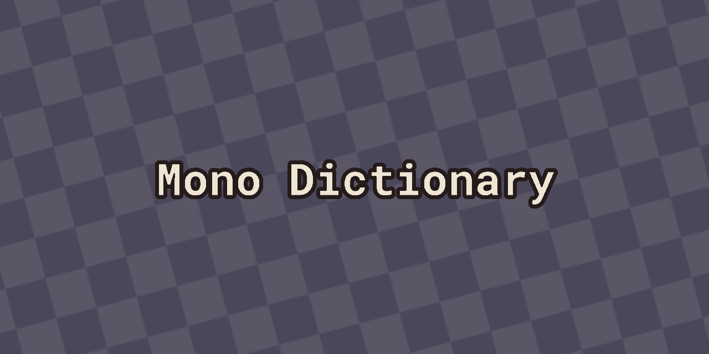

# Mono Dictionary
A simple English web dictionary made with Vue.js.



Made possible with the [Free Dictionary API](https://github.com/meetDeveloper/freeDictionaryAPI).

Provides the following for each word:
- Definitions
- Senses
- Parts of speech
- Phonetics (with audio)
- Examples
- And more!

The website also supports multiple color schemes! Available by clicking the upper right semi-circle icon.

## Link
[Click here to access the website!](https://mono-dictionary.netlify.app/)

## Project setup
```
npm install
```

### Compile for development
```
npm run serve
```

### Compile for production
```
npm run build
```

## Author
Developed by [Vincent Simard-Schmidt](https://www.linkedin.com/in/vincent-simard-schmidt-1a2645215/).
